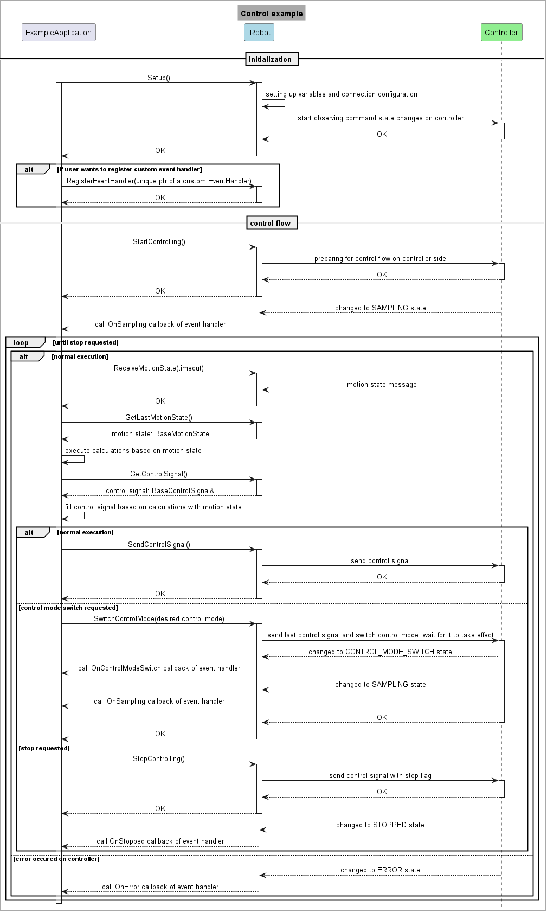
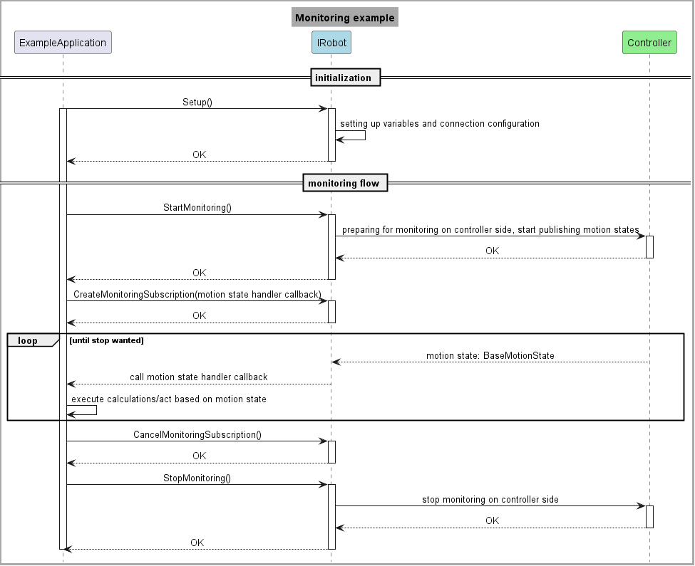

# KUKA External Control SDK

This guide will help you understand how to use the SDK to control your robot externally. You'll find information on the SDK's structure and setup instructions tailored to different systems.

## Select Your Setup Guide

Depending on the system you are using, refer to one of the following documents for setup:

- [External Control Setup for iiQKA](kuka_external_control_sdk/doc/iiqka_setup.md)
- [External Control Setup for KSS with EKI](kuka_external_control_sdk/doc/kss_eki_setup.md)

## Overview

To use the SDK effectively, it's important to understand its structure. The core component is the `Robot` class and its `IRobot` interface, which represent the external control service running on the robot controller.

The `IRobot` interface abstracts OS-specific operations from the user to enhance modularity. It enables external control in a standardized and flexible manner.

### IRobot Interface Methods

The methods of the IRobot class provide the general interface:

- `Setup()`: Sets up the network connection with the robot controller.
- `StartControlling(ControlMode control_mode)`: Starts the external control session on the controller.
- `StartMonitoring()`: Starts external monitoring, allowing the robot to publish motion states.
- `CreateMonitoringSubscription(std::function<void(BaseMotionState&)> callback)`: Creates a subscriber to the robot's motion states on the client side.
- `CancelMonitoringSubscription()`: Terminates the motion state subscriber on the client side.
- `HasMonitoringSubscription()`: Checks if the client is currently subscribed to the robot's monitoring messages.
- `StopControlling()`: Stops the external control session on the controller. The stop signal must be sent in response to a motion state; the function also waits for a new request if none is currently active.
- `StopMonitoring()`: Stops the motion state publisher on the controller.
- `SendControlSignal()`: Sends the control signal to the controller.
- `ReceiveMotionState(std::chrono::milliseconds timeout)`: Attempts to receive the current motion state of the robot within the provided timeout.
- `GetControlSignal()`: Returns the most recent control signal, which the user can fill with the desired data.
- `GetLastMotionState()`: Returns the most recent motion state of the control flow.
- `SwitchControlMode(ControlMode control_mode)`: Changes the control mode to the one specified in the parameter.
- `RegisterEventHandler(std::unique_ptr<EventHandler>&& event_handler)`: Allows the user to react to events streamed from the controller.

### SDK Usage

In this section, we'll describe a general use case for both controlling and monitoring, using sequence diagrams to illustrate the process.

#### Control Example

To begin, call `Setup` on the specific instance of the `IRobot` interface. This will initialize the necessary variables and communication channels. If successful, you can start external control.

After issuing a successful `StartControlling` call, the control cycle begins. In each iteration, the robot controller sends the current motion state of the robot, which the client receives using the `ReceiveMotionState` function. The client must then send the next calculated control signal using the `SendControlSignal` function within the defined cycle time.

Instead of manually creating the control signal objects, retrieve the stored instances using the `GetLastMotionState` and `GetControlSignal` methods.

From the user's perspective, the `MotionState` is a read-only object filled when the packet containing its binary representation is received and decoded. It provides getters for the positions, torques, and velocities of individual joints.

The `ControlSignal` is the opposite: it's a write-only object that the user must fill with the desired goal positions, torques, joint impedance attributes, etc., in each tick. If the `ControlSignal` is not modified but sent out using the `SendControlSignal` call, the internal control signal will contain the previous values.

**Note**: In the received motion states, the torque values have the opposite sign of what the client is expected to send out during torque control. To move a joint in the positive direction, a positive torque is needed, but the motion state will contain a negative measured torque due to internal conventions.

As stated in the interface description, you can register an `EventHandler` to react to events (e.g., sampling started, control mode switched, control stopped, error detected) from the controller. To do this, implement a class that derives from the default `EventHandler` base and override the desired functions.

To change the control mode at runtime, issue the `SwitchControlMode` call. If successful, send control signals for the new control mode from that point on.

Since real-time communication follows a request-reply pattern, the `StopControlling` and `SwitchControlMode` methods must be sent as a reply to a received request; otherwise, an error is returned. The first `MotionState` may arrive later directly after a switch, so it's recommended to use a higher timeout (around 1 second) for the following receive. Depending on network quality, these operations may need to be retried due to potential packet losses.

#### Monitoring Example

To start the monitoring flow, initialize with `Setup` and call `StartMonitoring`.

In addition to the `StartMonitoring` call, there's a separate `CreateMonitoringSubscription` operation. The former starts publishing motion states on the controller, while the latter creates a subscriber on the client to receive the published states. This allows for subscriptions from multiple clients.

To handle incoming monitoring messages according to your specific use case, create a callback and pass it to the `CreateMonitoringSubscription` function.

To stop monitoring on the client side, call `CancelMonitoringSubscription`. To stop publishing on the controller, call `StopMonitoring`.

### OS-Specific Implementations

To learn more about the SDK implementation for specific robot controller systems, refer to one of the following:

- [iiQKA.OS1 Implementation](kuka_external_control_sdk/doc/iiqka_implementation.md)
- [KSS Implementation](kuka_external_control_sdk/doc/kss_implementation.md)
