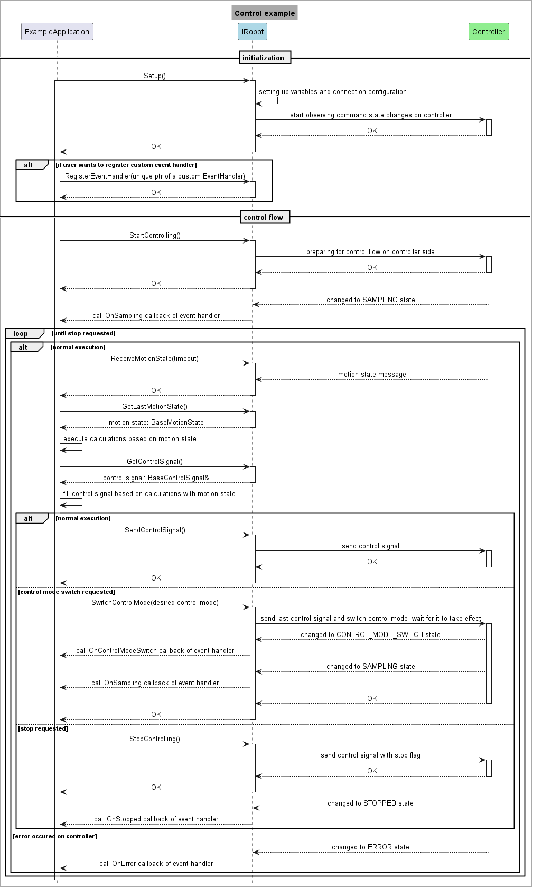

<style>
h2   {font-size: 1.7em;}
h3   {font-size: 1.4em;}
h4   {font-size: 1.17em;}
</style>

<h1>KUKA.iiQKA.ExternalAPI.Control SDK</h1>

KUKA.iiQKA.ExternalAPI.Control is an option package on iiQKA 1.2. It allows you to connect remotely to a KUKA KR C5 Micro running this option package and externally control an LBR iisy 3, LBR iisy 11, or LBR iisy 15.

This SDK makes it easy to develop client applications for externally controlling iiQKA robots.

<h2>Requirements</h2>

- Linux as the operating system
- A compiler that supports the C++17 standard.
- Installation of the following packages (specified for Ubuntu/debian/Mint):
    - cmake
    - build-essential
    - pkg-config
    - libssl-dev
    - protobuf-compiler-grpc
    - nanopb
    - libnanopb-dev
    - python3-protobuf
    - libgrpc++-dev

<h2>Build and installation</h2>

If all requirements are met, the SDK can be installed with cmake:

```bash
cd <clone of this repository>
mkdir build && cd build
cmake ..
make
sudo make install
```

This will install the necessary headers and the library itself, which can then be used from the client application's CMake project.
A separate shared library (kuka-external-control-sdk-protobuf) is defined and exported for the generated protobuf object to allow the client to bypass the client library and use the raw protos, if they wish to use a lower level API instead of a fully fledged SDK.

An example CMakeLists.txt for a simple application with a single source file would look like this:

```cmake

cmake_minimum_required(VERSION 3.13)

project(${DEBIAN_PROJECT_NAME}
  VERSION ${DEBIAN_PROJECT_VERSION}
)

# Project dependencies
find_library(kuka-external-control-sdk REQUIRED) # ignore if using the raw protos
find_package(PkgConfig REQUIRED)

pkg_check_modules(gRPC REQUIRED grpc++)

add_executable(client_app client_application.cc)

target_link_libraries(client_app
  kuka-external-control-sdk # ignore if using the raw protos
  ${gRPC_LIBRARIES}
  kuka-external-control-sdk-protobuf
)
```

<h2>Structure of the SDK</h2>

To be able to use the SDK properly, it's important to understand how it's structured. The main building block is the Robot class and its IRobot interface, which represent the external control service running on the robot controller.

<h3>Structure of the SDK - OS agnostic robot interface</h3>

The OS-agnostic IRobot interface abstracts the OS-specific operations away from the user (for modularity reasons) and provides a possibility for external control in a general way.

<h4>Basic structure</h4>

The methods of the IRobot class providing the general interface:

- _Setup()_ : Attempts to setup the network connection with the robot controller.
- _StartControlling()_ : Start the external control session on the controller.
- _StartMonitoring()_ : Start external monitoring: the robot will start publishing motion states.
- _CreateMonitoringSubscription(monitoring callback)_: Creates a subscriber to the robot's motion states on the client side.
- _CancelMonitoringSubscription()_ : Terminates the motion state subscriber on the client side.
- _IsSubscribedToMonitoring()_ : Checks if the client is currently subscribed to the monitoring messages of the robot.
- _StopControlling()_ : Stops the external control session on the controller.
- _StopMonitoring()_ : Stops the motion state publisher on the controller.
- _SendControlSignal()_ : Sends out the control signal to the controller.
- _ReceiveMotionState(timeout)_ : Attempts to receive the current motion state of the robot within the provided timeout.
- _GetControlSignal()_ : Returns the most recent control signal, which the user can fill with the desired data.
- _GetLastMotionState()_ : Returns the most recent motion state of the control flow.
- _SwitchControlMode(control mode)_ : Changes the control mode to the one specified in the parameter.
- _RegisterEventHandler(event handler)_ : Allows the user to react to events streamed from the controller.

<h4>Usage</h4>

In this section we'll describe a general use case of both controlling and monitoring with the help of sequence diagrams.

Control example:



The expected usage is to first call _Setup_ on the specific instance of the IRobot class which will initialize the necessary variables and communication channels. If this succeed, then external control can be started:

After a successful _StartControlling_ call is issued, the control cycle is started: in every iteration the robot controller will send out the current motion state of the robot, which the client receives with the _ReceiveMotionState_ function. To which the next calculated control signal must be sent out with the _SendControlSignal_ function as a reply within the defined cycle time.

Instead of manually creating these objects, the user has to retrieve the stored instances using the _GetLastMotionState_ and _GetControlSignal_ methods.

From the user's perspective, the MotionState is a read-only object that is filled when the packet containing its binary representation is received and decoded. It contains getters to the positions, torques and velocities of individual joints.

The ControlSignal is the opposite: it's a write-only object that has to be filled by the user with the goal positions, torques, joint impedance attributes, etc. in every tick. If the ControlSignal is not modified but sent out using the _SendControlSignal_ call, the internal control signal will contain the previous values.

<span style="color:red;font-weight:700;font-size:14px">One thing you have to be aware of is that in the received motion states, the torque values have different sign than the client is expected to send out in each tick during torque control. (To move a joint in the positive direction, a positive torque is needed, however the motion state will contain a negative measured torque in this cases due to internal conventions).</span>

As stated in the interface description, it's possible to register an EventHandler, which reacts to events (sampling started, control mode switched, control stopped, error detected) coming from the controller as specified. For this the implemented class should derive from the default EventHandler base and override the desired functions.

To change the control mode in runtime, the SwitchControlMode call has to be issued. If that succeeds, control signals of the new control mode have to be sent from the change on.

Since the real-time communication follows a request-reply pattern, the _StopControlling_ and _SwitchControlMode_ methods have to be sent as a reply to a received request, otherwise an error is returned. It's also possible for the first MotionState to arrive later directly after a switch, so it's recommended to use a higher timeout (around 1 second) in the following receive.
Do note that depending on the network quality, these operations might have to be retried due to potential packet losses.


Monitoring example:


The user can start the monitoring flow by initializing with _Setup_ and calling _StartMonitoring_.

Beside the _StartMonitoring_ call there's a separate _CreateMonitoringSubscription_ operation. The difference between the two is that the former starts the publishing of motion states on the controller, while the latter creates a subscriber on the client that receives the published states. This makes it possible to create subscriptions from multiple clients.

To react according to the specific use case, a callback handling the incoming monitoring messages has to be created and get passed to the _CreateMonitoringSubscription_ function as a parameter.

To stop monitoring on the client side, call _CancelMonitoringSubscription_, to stop publishing on the controller, call _StopMonitoring_.


<h3>Structure of the SDK - iiQKA specific robot interface</h3>

The iiQKA Robot class introduces OS specific features. It uses gRPC for non-real-time communication such as configuration and state management operations, and UDP for the real-time part - controlling and monitoring.

<h4>Structure</h4>

The extra method of the Robot class providing the specific interface:

- _SetQoSProfile(qos configuration)_ : Sets the Quality of Service (QoS) configuration for external control on the controller. If successful, the next session will be started with this configuration.

With this _SetQoSProfile_ function the user can set the QoS coniguration, which is detailed later.

<h4>Configuration</h4>

Before creating the iiQKA-specific Robot object, an initial configuration has to be provided via the namespaced Configuration class. It should contain the IP addresses of the KRC5 Micro on the KONI interface and the IP address of the client machine. Aside from that, the initial control mode has to be provided, else the controlling will fail with the 'unsupported control mode' error message.

During controlling, the UDP packets are by default sent and received through a secure DTLS layer. So the user has to provide a certificate and private key and set the path of these files in the configuration. (For generating a certificate and a private key see an example [here](https://stackoverflow.com/a/10176685) or check out the [official documentation](https://www.openssl.org/docs/manmaster/man1/openssl.html).) It's possible opt-out from the secure controlling mode by setting the 'is_secure' flag to false.

The currently supported control modes are:
 - Joint position control
 - Joint impedance control
 - Joint torque control

Aside from these, the configuration also contains values that can't be modified.
These are the

1. Port numbers. During controlling, the packets are received on the 44444 port, and on the 44446 port during monitoring.
2. Cycle time. The cycle time is 4 milliseconds, or 250 Hz. This is enforced by the motion layer and can't be higher or lower.
3. Multicast IP address for monitoring, which is 239.255.123.250.

<h4>QoS configuration</h4>

Since the UDP protocol is unreliable, we have created a simple QoS profile which monitors the number of lost packets in a given timeframe, and the number of consecutively lost packets. These are measured on the controller side and used to terminate the connection when the network quality is not suitable for external robot control.

The following parameters of the profile can be tailored to the specific use case:
* number of consecutively lost packets - _default = 2_
* number of lost packets allowed in a timeframe - _default = 3_
* the timeframe - _default = 200 ms_

If no QoS profile is set at all before the call to StartControlling, a default profile will be used internally.
It's possible to update the settings using the _SetQoSProfile_ call of the SDK. The configured values should meet the given constraints:

* The user cannot set the consequent packet losses to be bigger than 5, therefore external control always stops within 20 ms of a connection loss.
* The user cannot set the timeframe/packet loss ratio to be smaller than 40 to disallow too lossy connections.
* The user cannot set the allowed packet losses in a timeframe to be bigger than 25 to disallow too many lost packets in a concentrated part of a larger timeframe.
* The user cannot set the timeframe to be bigger than 1 hour.
* If the user tries to set an invalid QoS profile, external control cannot be started until a valid profile is set.
* If the user would like to set a QoS profile that does not allow any packet losses, only the consecutively lost packets should be set to 0!

If any of the above requirements is violated, the QoS profile will not be set, and the user will have to provide a valid profile to be able to start controlling the robot. This applies only if the QoS configuration is invalid.

<h2>How to use the SDK from code</h2>

Here's a simple example of how the SDK can be used for controlling an iiQKA robot.

```cpp
    #include "kuka/external-control-sdk/common/message_builder.h"
    #include "kuka/external-control-sdk/iiqka/robot.h"

    int main(int argc, char const *argv[]) {
    // Configure general setup - IP addresses, control mode
    kuka::external::control::iiqka::Configuration eci_config;
    eci_config.client_ip_address = "127.0.0.1"; // client ip address
    eci_config.koni_ip_address = "127.0.0.1"; // KRC IP address
    eci_config.initial_control_mode = kuka::external::control::ControlMode::JOINT_POSITION_CONTROL;

    // Create interface
    kuka::external::control::iiqka::Robot rob_if(eci_config);
    OperationStatus setup_ret = rob_if->Setup();
```

The above code creates a configuration which will be used for creating the instance of the client library's Robot object. After that, the sockets used for communicating with the robot can be created, allowing us to start controlling or monitoring later. Note that the configuration with which the Robot instance is created can not be modified later for the given object.

The next step is to call StartControlling and create a control loop. It's recommended to always check the returned status of each operation, which we omitted to make the example concise.

```cpp

  rob_if->StartControlling();

  // Degree of freedom
  size_t dof = 6;
  kuka::external::control::BaseMotionState actual_state(dof); // Motion state filled when received from the controller.

  while (true) {
    rob_if->ReceiveMotionState(/* timeout */);

    actual_state = rob_if->GetLastMotionState(); // gives access the current position, velocity or torques values

    // ... calculate next control signal based on the actual state

    rob_if->GetControlSignal().AddJointPositionValues(/* calculated joint position values */);
    rob_if->SendControlSignal(); // or call rob_if->SwitchControlMode() instead to change the control mode, or StopControlling() to stop the control session.
  }
```


Examples for controlling the robot and starting a monitoring session also come with the SDK. The IP addresses of the controller and the client machine have to be configured in the code, and for the controlling example, it is recommended to set the robot axes into a 'candle' position at the start to <p style="font-size: 12px;">{A1: 0°, A2: -90°, A3: 0°, A4: 0°, A5: 0°, A6: 0°}</p>

because it's executing a sine movement.

These examples can be tried out by building their CMake project after installing the SDK library.


<h2>License</h2>

The library is licensed under Apache-2.0.

