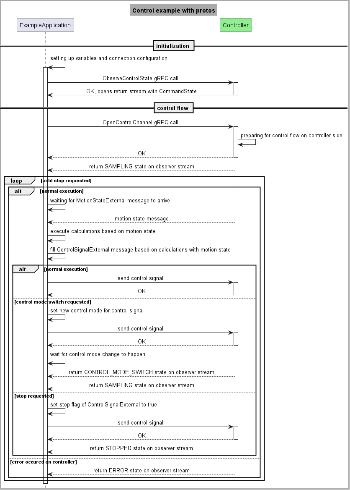
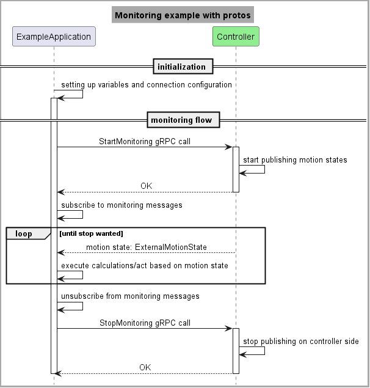

In this file we show how the SDK functions are mapped to the usage with raw proto files.
We need the motion_services_ecs.proto to see the required gRPC calls.
In the real-time data flow we get messages described by the motion_state_external.proto and send ones described by the control_signal_external.proto file. 

Control example with raw protos:

Monitoring example with raw protos:

